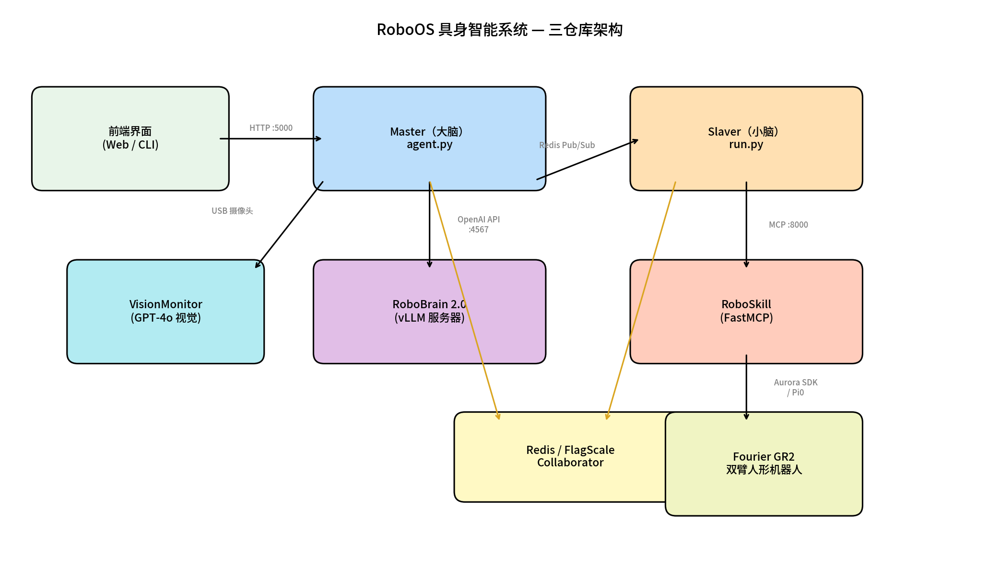
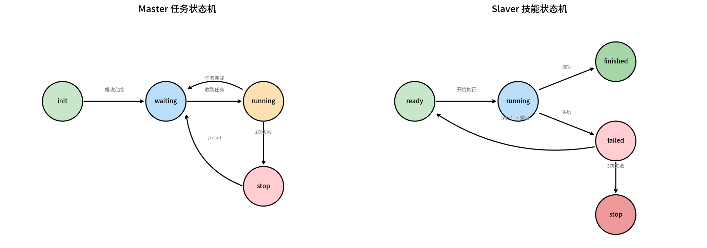
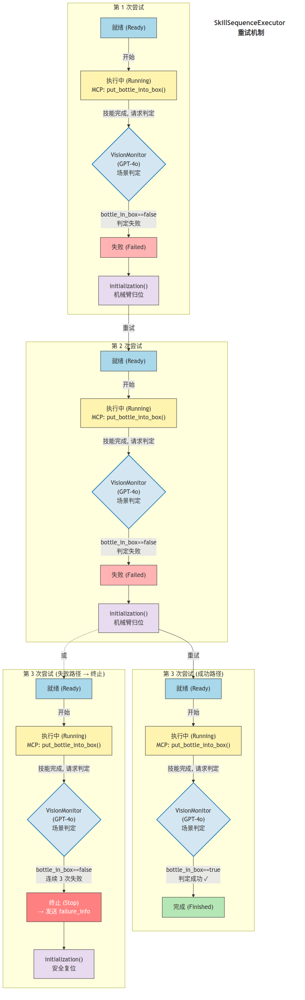
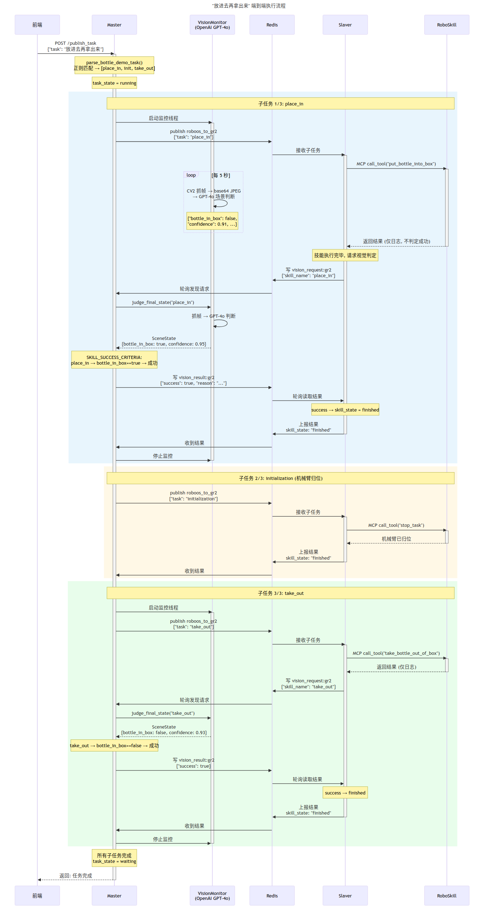

# RoboOS 具身智能系统 — 技术报告

## 以"抓杯子"Demo为案例

---

## 1. 引言

### 1.1 背景

随着大语言模型（LLM）与具身智能（Embodied AI）的深度融合，机器人系统正从硬编码程序向自然语言理解、自主规划、感知反馈的新范式演进。本项目实现了一套**三仓库协同**的机器人操作系统，并通过一个代表性场景进行验证：Fourier GR2 双臂人形机器人将杯子放入白色纸盒并取出，展示了从自然语言指令到物理动作执行的完整闭环。

### 1.2 系统定位

| 仓库 | 角色 | 类比 |
|------|------|------|
| **RoboOS** | 机器人操作系统（Master + Slaver） | 操作系统内核 + 设备驱动 |
| **RoboBrain 2.0** | 具身大脑模型（视觉-语言-推理） | CPU / AI 推理引擎 |
| **RoboSkill** | 原子技能库（MCP 标准化） | 系统调用 / 驱动接口 |

三个仓库通过 **Redis Pub/Sub**（进程间通信）和 **MCP 协议**（技能调用）松耦合连接，支持多机器人、多场景、多模型的灵活组合。

---

## 2. 系统架构

### 2.1 三仓库架构概览



系统采用**分层 Master-Slaver 架构**：

- **Master（大脑）**：接收自然语言指令，理解意图，规划子任务序列，调度至 Slaver 执行，并通过实时视觉反馈进行监控
- **Slaver（小脑）**：接收子任务，映射到原子技能 API，驱动机器人执行，管理技能状态机和失败重试
- **RoboSkill（执行器）**：MCP 标准化的原子技能服务器，封装硬件 SDK（Aurora SDK、Pi0 VLA 模型），提供统一的工具接口
- **RoboBrain 2.0（AI 引擎）**：基于 Qwen2.5-VL 的多模态大模型，提供意图分类和任务规划能力，支持 Tool Calling 和 Chain-of-Thought 推理
- **Redis / FlagScale Collaborator**：分布式状态管理和消息中间件，处理智能体注册、心跳、任务调度、结果上报和场景状态同步

### 2.2 通信架构

```
┌────────────┐    HTTP :5000     ┌────────────┐    Redis Pub/Sub    ┌────────────┐
│   前端界面  │ ───────────────→ │   Master    │ ←─────────────────→ │   Slaver   │
│  (Web/CLI)  │ ←─────────────── │  (agent.py) │                     │  (run.py)  │
└────────────┘    JSON 响应      └─────┬───────┘                     └─────┬──────┘
                                       │ OpenAI API :4567                   │ MCP :8000
                                       ▼                                    ▼
                                ┌──────────────┐                    ┌──────────────┐
                                │ RoboBrain 2.0│                    │  RoboSkill   │
                                │ (vLLM 服务器) │                    │ (FastMCP)    │
                                └──────────────┘                    └──────────────┘
```

**关键通信协议：**

| 通道 | 协议 | 用途 |
|------|------|------|
| 前端 ↔ Master | HTTP REST (Flask) | 任务发布、状态查询、手动控制 |
| Master ↔ RoboBrain | OpenAI 兼容 API | 意图分类、子任务规划 |
| Master ↔ Slaver | Redis Pub/Sub (FlagScale) | 子任务调度、结果上报、状态同步 |
| Slaver ↔ RoboSkill | MCP streamable-http | 原子技能调用 |
| RoboSkill ↔ 机器人 | Aurora SDK (DDS) / Pi0 | 关节控制、VLA 推理 |
| Master → GPT-4o | OpenAI Vision API | 视觉监控判断 |

---

## 3. 核心模块详解

### 3.1 Master 模块

Master 是中央编排枢纽，负责从自然语言到子任务序列的完整流水线。

#### 3.1.1 三层指令处理流水线

Master 采用**确定性优先、LLM 兜底**的三层策略：

```
用户指令（自然语言）
    │
    ▼
第1层：确定性正则解析 (parse_bottle_demo_task)
    │   匹配成功 → 直接生成技能序列 (<100ms, 无需LLM)
    │   匹配失败 ↓
    ▼
第2层：LLM 意图分类 (planner.classify)
    │   → PUT / TAKE / PUT_THEN_TAKE / TAKE_THEN_PUT / INVALID
    │   INVALID → 拒绝执行
    ▼
第3层：LLM 子任务规划 (planner.plan)
    │   → {reasoning_explanation, subtask_list}
    ▼
子任务序列 → _dispatch_subtasks_async()
```

**设计理念：** 对于 Bottle Demo 已知的4种指令，正则解析比 LLM 快100倍、100%确定性、零 Token 消耗。LLM 仅作为未识别指令的兜底，保持系统可扩展性。

#### 3.1.2 两阶段 LLM 规划器

GlobalTaskPlanner 将传统的单次 LLM 调用拆分为两个阶段：

| 阶段 | 输入 | 输出 | max_tokens | 目的 |
|------|------|------|-----------|------|
| classify | 原始用户指令 | 意图标签（1个词） | 64 | 快速分类，过滤无效指令 |
| plan | 意图 + 场景 + 机器人能力 | JSON 子任务列表 | 1024 | 完整规划 |

**优势：** classify 阶段极度轻量，以最小延迟过滤 INVALID 指令；plan 阶段拥有完整上下文，规划质量更高。

#### 3.1.3 GPT-4o 视觉监控 (VisionMonitor)

Master 在每个子任务执行期间启动 VisionMonitor 线程，利用顶视 USB 摄像头 + OpenAI GPT-4o 视觉能力进行主动监控。实现使用 `openai` Python SDK，通过 `chat.completions.create()` API 发送 base64 编码的 JPEG 帧，并以 `response_format={"type": "json_object"}` 强制 JSON 输出。

```
子任务下发 → 启动监控线程
               │
               ├── 每5秒：CV2 抓帧 → base64 JPEG → OpenAI GPT-4o 判断
               │   返回：{"bottle_in_box": true/false,
               │          "bottle_on_paper": "yellow"/"green"/null,
               │          "reason": "...", "confidence": 0.92}
               │
               ├── confidence ≥ 0.7 → 记录到执行事件日志
               │
子任务结束 → 停止监控 → 终态确认（最后一帧 GPT-4o 复核）
```

**关键设计决策：**
- **补充而非替代** Slaver 的 skill_state 上报 — 两个信息源交叉验证
- **置信度阈值 0.7** — 低置信度判断不触发干预，避免误报
- API 调用失败时自动降级 — 不阻塞正常执行流程
- 支持自定义 `base_url`，兼容 OpenAI 兼容的第三方 API 端点

#### 3.1.4 任务状态机



Master 维护全局任务状态：`init → waiting → running → stop/waiting`

- **init**：系统启动中
- **waiting**：等待用户指令（接受新任务）
- **running**：任务执行中（拒绝新任务）
- **stop**：任务已终止（需 `/reset` 恢复）

所有状态转换均记录在**执行事件日志**中，可通过 `/task_state` API 实时查询。

### 3.2 Slaver 模块

Slaver 是 Master 与硬件之间的桥梁，将抽象子任务转化为具体的 MCP 技能调用。

#### 3.2.1 双路径执行引擎

```python
async def _execute_task(self, task_data):
    task = task_data["task"]

    if is_bottle_demo_task(task):
        # 确定性路径：直接映射到 MCP 技能
        executor = SkillSequenceExecutor(tool_executor=self.session.call_tool)
        result = await executor.execute(task)
    else:
        # LLM 路径：ReAct 循环 + 语义工具匹配
        agent = ToolCallingAgent(tools=filtered_tools, ...)
        result = await agent.run(task)
```

| 路径 | 触发条件 | 引擎 | LLM | 延迟 |
|------|---------|------|-----|------|
| 确定性 | 子任务名 ∈ {place_in, take_out, initialization} | SkillSequenceExecutor | 无 | ~0ms（不含技能执行） |
| LLM驱动 | 所有其他任务 | ToolCallingAgent (ReAct) | 是 | ~5-10s |

#### 3.2.2 SkillSequenceExecutor 状态机与重试



SkillSequenceExecutor 实现了需求规格中定义的完整技能状态机（S-2.1 至 S-2.6）：

```
ready → running → finished（成功）
              ↘ failed → initialization() → ready（重试）
                                              ↘ stop（连续3次失败）
```

**关键行为：**
1. 每次失败后，**必须调用 `initialization()` 将机械臂归位**后才能重试
2. 如果 `initialization()` 本身失败，立即停止执行（无法安全重试）
3. 连续3次失败 → 发送 `skill_state="stop"` + `failure_info` 给 Master
4. 终止前尝试调用 `initialization()` 回到安全位置

**成功/失败判定：** 技能的 MCP 返回值**仅用于日志记录，不参与判定**。技能执行完成后，Slaver 通过 `vision_judge` 回调请求 Master 端 VisionMonitor（GPT-4o）进行场景判定：
- `place_in` 成功条件：`bottle_in_box == true`
- `take_out` 成功条件：`bottle_in_box == false`
- VisionMonitor 不可用时自动降级为假定成功，避免视觉服务故障阻断任务

#### 3.2.3 ToolMatcher 语义工具选择

对于非 Bottle Demo 任务，Slaver 使用三级语义匹配策略选择最相关的工具：

| 优先级 | 方法 | 模型 | 场景 |
|--------|------|------|------|
| 1 | Sentence Transformer 嵌入 | all-MiniLM-L6-v2 | GPU 可用 / 在线 |
| 2 | TF-IDF 向量化 | sklearn | 无 Transformer |
| 3 | 关键词匹配 | 规则 | 最小依赖 |

**效果：** 从 100+ 可用工具中筛选 Top-N 最相关工具（默认5个），显著减少 LLM 上下文窗口占用，提高规划准确率。

### 3.3 RoboSkill 模块

RoboSkill 是 **MCP 标准化的原子技能服务器**，为不同机器人平台提供统一的技能接口。

#### 3.3.1 MCP 协议集成

```python
from mcp.server.fastmcp import FastMCP

mcp = FastMCP(name="gr2_robot", stateless_http=True, host="0.0.0.0", port=8000)

@mcp.tool()
async def place_in() -> tuple[str, dict]:
    """将杯子从桌面上拿起并放入白色纸盒中。"""
    ...
```

**关键设计决策：**
- `stateless_http=True`：无状态 HTTP 传输，每个请求独立处理，支持水平扩展
- 工具 docstring 作为 LLM 可读的 API 文档，自动暴露给 Slaver 的 ToolCallingAgent
- 返回格式约定：`tuple[str, dict]`，失败字符串包含 `"FAILED"` 关键字

#### 3.3.2 Bottle Demo：三个原子技能

| 技能 | 控制方式 | 输入 | 输出 |
|------|---------|------|------|
| `place_in()` | Pi0 VLA 模型 | 3路摄像头 + 机器人状态 + 文本指令 | 50步动作块 (29维 @15Hz) |
| `take_out()` | Pi0 VLA 模型 | 同上 | 同上 |
| `initialization()` | Aurora SDK 直接控制 | 当前关节角度 | 最短路径轨迹 |

#### 3.3.3 GR2Manager 硬件抽象

GR2Manager 封装了 Aurora SDK 连接管理和 Pi0 推理进程的完整生命周期：

```
GR2Manager
├── connect()                       → Aurora SDK DDS 连接
├── start_pi0_server(model_path)    → 启动推理服务进程
├── start_pi0_client(task)          → 启动动作执行进程
├── stop_pi0()                      → 终止推理/执行进程
├── move_to_initial_position()      → Aurora SDK 关节控制
└── is_pi0_running()                → 检查推理进程状态
```

**线程安全：** 所有方法均由 `threading.Lock()` 保护，确保并发 MCP 请求不会导致硬件状态冲突。

#### 3.3.4 Mock 测试与故障注入

`skill_mock.py` 提供与生产版本完全一致的 MCP 接口签名，额外支持：

- **模拟执行延迟**：`MOCK_PLACE_IN_DURATION=5s` 等环境变量
- **状态追踪**：`MockState` 类维护 `connected` 和 `at_init_position` 状态
- **前置条件检查**：与生产版本相同的前置条件逻辑
- **基于文件的故障注入**：写入 `/tmp/gr2_mock_fail.json` 触发指定技能失败

```bash
# 触发 place_in 失败
echo '{"place_in": "杯子倒了"}' > /tmp/gr2_mock_fail.json
```

#### 3.3.5 多机器人支持

RoboSkill 仓库采用 `vendor/model/skill.py` 目录结构，当前支持：

| 机器人 | 类型 | 技能数 | 亮点 |
|--------|------|--------|------|
| Fourier GR2 | 双臂人形 | 3 | Pi0 VLA + Aurora SDK |
| LeRobot SO101 | 单臂桌面 | 13 | ACT 策略网络 + 异步推理 |
| Realman RMC-LA | 移动操作 | 2 | GroundingDINO 检测 + RealSense 深度 |
| Demo Robot | 参考实现 | 3 | 开发模板 |

### 3.4 RoboBrain 2.0

RoboBrain 2.0 是由智源研究院（BAAI）开发的**具身智能大脑模型**，为 RoboOS 提供视觉理解、语言推理和任务规划能力。

#### 3.4.1 模型架构

```
视觉输入（多图 / 视频）
    │
    ▼
视觉编码器 (Qwen2.5-VL)
    │
    ▼
MLP 映射器 → 统一Token流
    │
    ▼
LLM 解码器 → 文本输出 / 工具调用 / 坐标 / 轨迹
```

**模型变体：**

| 变体 | 参数量 | 思维支持 | 推荐场景 |
|------|--------|---------|---------|
| RoboBrain 2.0-3B | 30亿 | 否 | 轻量推理、边缘部署 |
| RoboBrain 2.0-7B | 70亿 | 是 | 性能均衡（本项目使用） |
| RoboBrain 2.0-32B | 320亿 | 是 | 最优性能 |

#### 3.4.2 思维机制

7B/32B 模型支持通过 `<think>` 标签进行链式推理（Chain-of-Thought）：

```xml
<think>
用户说了"放进去"，这是一个 PUT 类型的指令。
需要调用 place_in() 将杯子放入盒子中。
</think>
<answer>
{"intent": "PUT"}
</answer>
```

该机制已被 NeurIPS 2025 接收（Reason-RFT 策略）。

#### 3.4.3 工具调用集成

RoboBrain 2.0 实现了**启发式工具选择 + 语义参数提取**：

1. 从 RoboOS 解析工具定义（兼容 OpenAI 和 MCP 两种格式）
2. 通过 prompt 文本匹配选择最相关的工具
3. 三级参数提取：语义映射 → 描述示例 → 类型推断
4. 返回 OpenAI 兼容的 `tool_calls` 格式

#### 3.4.4 部署方式

```bash
# FastAPI + vLLM 推理服务器
python inference.py --serve \
    --host 0.0.0.0 --port 4567 \
    --model-id /path/to/RoboBrain2.0-7B \
    --device-map auto \
    --enable-thinking
```

暴露 `/v1/chat/completions` 端点，完全兼容 OpenAI API 格式。RoboOS 通过标准 openai Python SDK 连接。

### 3.5 FlagScale Collaborator

FlagScale 是智源框架研发团队开发的分布式智能体协作框架。RoboOS 使用其 `Collaborator` 类作为 Redis 抽象层。

**核心能力：**

| 功能 | 方法 | Redis 结构 |
|------|------|-----------|
| 智能体注册 | `register_agent(name, data)` | Hash: AGENT_INFO |
| 心跳保活 | `agent_heartbeat(name, ttl)` | 带 TTL 的 Key |
| 任务调度 | `send(channel, msg)` | Pub/Sub |
| 结果监听 | `listen(channel, callback)` | Pub/Sub Subscribe |
| 忙闲管理 | `update_agent_busy(name, busy)` | Hash: AGENT_BUSY |
| 同步等待 | `wait_agents_free(names, timeout)` | 轮询 AGENT_BUSY |
| 场景状态 | `record_environment(name, json)` | Hash: ENVIRONMENT_INFO |

---

## 4. "抓杯子" Demo：端到端流程

### 4.1 场景定义

- **物品**：1个蓝色花纹瑞幸咖啡杯、1个固定位置的白色纸盒
- **指令**：4种基本指令类型 + 多步链式指令（挑战目标）
- **机器人**：Fourier GR2 双臂人形机器人

### 4.2 执行流程



以指令 **"把杯子放进盒子里，然后再取出来"** 为例：

| 步骤 | 组件 | 动作 | 延迟 |
|------|------|------|------|
| 1 | 前端 | `POST /publish_task {"task": "放进去再拿出来"}` | — |
| 2 | Master | `parse_bottle_demo_task()` 正则匹配 → `[place_in, init, take_out]` | <1ms |
| 3 | Master | 创建 task_id，设置 `running` 状态，启动异步调度 | <1ms |
| 4 | Master | 通过 Redis 发布 `place_in` 到 Slaver | <1ms |
| 5 | Master | 启动 VisionMonitor 线程 | <1ms |
| 6 | Slaver | `is_bottle_demo_task("place_in")` → SkillSequenceExecutor | <1ms |
| 7 | Slaver | `session.call_tool("place_in", {})` 通过 MCP | — |
| 8 | RoboSkill | 启动 Pi0 Server + Client，VLA 推理执行 | ~30-60s |
| 9 | RoboSkill | 返回 `("杯子放置成功", {...})` | — |
| 10 | Slaver | 未检测到 "FAILED" → `finished`，上报结果 | <1ms |
| 11 | Master | VisionMonitor 终态确认：GPT-4o 判断 "completed" (95%) | ~3s |
| 12 | Master | 发布 `initialization` → Slaver → 机械臂归位 | ~3-5s |
| 13 | Master | 发布 `take_out` → 重复步骤 6-11 | ~30-60s |
| 14 | Master | 所有子任务完成 → `task_state = waiting` | <1ms |

### 4.3 失败处理示例

假设 `place_in` 执行过程中杯子倒了：

```
第1次尝试：place_in() → FAILED: 杯子倒了
           → initialization() → 机械臂归位
第2次尝试：place_in() → FAILED: 杯子脱手
           → initialization() → 机械臂归位
第3次尝试：place_in() → FAILED: 执行超时
           → skill_state = "stop"
           → initialization()（安全复位）
           → failure_info = {failed_skill: "place_in", attempts: 3, ...}
           → Master: task_state = "stop"
```

---

## 5. 技术创新

### 5.1 确定性优先的混合调度架构

传统机器人系统要么完全依赖规则（缺乏灵活性），要么完全依赖 LLM（不够可靠）。本系统引入**三层渐进式**指令处理方案：

```
正则匹配（确定性, 0ms） → LLM 分类（轻量, ~1s） → LLM 规划（完整, ~5s）
```

- 已知指令走快速通道 — 100% 可靠
- 未知指令走 LLM 通道 — 保持可扩展性
- 两条路径产生统一输出格式 — 下游调度无感知

### 5.2 GPT-4o 主动视觉监控

不同于传统的串行"执行→判断→反馈"模式，本系统在 Master 层引入**并行视觉监控**：

- 执行与监控**并行运行** — 无额外串行延迟
- GPT-4o 多模态能力理解复杂场景语义（非仅像素级检测）
- 置信度机制防止低质量判断干扰正常执行
- 终态确认为 Slaver 上报提供**交叉验证**

### 5.3 MCP 标准化技能生态

所有机器人技能通过 MCP（Model Context Protocol）标准化：

- **统一接口**：任何 MCP 客户端均可调用技能，无需依赖特定 SDK
- **自描述性**：工具 docstring 作为 LLM 可读的 API 文档
- **无状态 HTTP**：支持水平扩展和负载均衡
- **多机器人复用**：同一 Slaver 可连接不同机器人的 MCP 服务器

### 5.4 RoboBrain 2.0 具身推理

基于 Qwen2.5-VL 的具身大脑模型具有独特优势：

- **多模态理解**：统一处理图像 + 视频 + 文本
- **思维机制**：`<think>` 标签实现可解释的推理链
- **工具调用**：启发式工具选择，无需微调即可适配新工具
- **多任务支持**：6种推理模式（通用、指向、可供性、轨迹、定位、导航）

### 5.5 FlagScale 分布式协作

基于 Redis 的 Collaborator 框架实现：

- **去中心化注册**：机器人自主注册、心跳保活、自动过期
- **异步消息**：Pub/Sub 解耦 Master 与 Slaver
- **场景共享**：ENVIRONMENT_INFO 实现多智能体共享环境感知
- **忙闲调度**：AGENT_BUSY + wait_agents_free 实现同步等待

### 5.6 Mock + 故障注入测试框架

RoboSkill 提供完整的离线测试框架：

- `skill_mock.py` 与 `skill.py` 接口签名完全一致
- 模拟状态追踪（connected, at_init_position）
- 基于文件的故障注入 — 精确控制哪个技能何时失败
- 支持不连接真实硬件的端到端 RoboOS 测试

---

## 6. 架构特点

### 6.1 松耦合分布式设计

三个仓库通过标准协议通信，无源码级依赖：

| 接口 | 协议 | 替换成本 |
|------|------|---------|
| Master ↔ Slaver | Redis Pub/Sub | 更换消息中间件 |
| Master ↔ RoboBrain | OpenAI API | 替换为任意兼容 API 的模型 |
| Slaver ↔ RoboSkill | MCP HTTP | 替换为任意 MCP 服务器 |

### 6.2 双路径容错

系统在多个层级实现容错：

```
指令理解：正则 → LLM（优雅降级）
工具匹配：Transformer → TF-IDF → 关键词（三级回退）
技能执行：成功 → 失败 → 重试 → 终止（状态机保障）
视觉监控：GPT-4o → 降级为仅 Slaver 上报（API 失败不阻塞）
```

### 6.3 线程安全并发

- Master：Flask 主线程 + 异步调度线程 + VisionMonitor 线程 + Redis 监听线程
- Slaver：asyncio 事件循环 + 心跳线程 + Redis 监听线程
- RoboSkill：GR2Manager 全方法加锁，Pi0 进程独立生命周期管理

### 6.4 可观测性

完整的执行事件日志系统：

```json
{
    "task_state": "running",
    "events": [
        {"time": "14:30:01", "type": "task_start",     "message": "收到指令: 放进去再拿出来"},
        {"time": "14:30:01", "type": "plan_done",       "message": "3个子任务: place_in → init → take_out"},
        {"time": "14:30:02", "type": "dispatch",        "message": "子任务 1/3: place_in → gr2"},
        {"time": "14:30:05", "type": "vision_check",    "message": "#1 执行中 (92%)"},
        {"time": "14:30:35", "type": "skill_done",      "message": "gr2: place_in → 杯子已放置"},
        {"time": "14:30:36", "type": "vision_final_ok", "message": "终态确认: place_in 完成 (95%)"},
        ...
    ]
}
```

### 6.5 配置驱动

所有组件行为均可通过 YAML 配置或环境变量调整：

- Master：`config.yaml`（模型选择、视觉监控、Redis 连接）
- Slaver：`config.yaml`（机器人类型、工具匹配参数、重试次数）
- RoboSkill：环境变量（模型路径、设备 ID、推理参数）

---

## 7. 文件结构

### RoboOS

```
master/
├── run.py                     # Flask API 服务器
├── config.yaml                # Master 配置
├── agents/
│   ├── agent.py               # GlobalAgent 核心编排
│   ├── planner.py             # 两阶段 LLM 规划器
│   ├── prompts.py             # CLASSIFY_PROMPT + PLANNING_PROMPT
│   └── vision_monitor.py      # GPT-4o 视觉监控
└── scene/
    └── profile.yaml           # 场景定义（桌面、纸盒）

slaver/
├── run.py                     # RobotManager + MCP 客户端
├── config.yaml                # Slaver 配置
├── agents/
│   ├── slaver_agent.py        # ToolCallingAgent (ReAct)
│   ├── skill_executor.py      # SkillSequenceExecutor（确定性）
│   └── models.py              # LLM 接口 (OpenAI/Azure)
└── tools/
    ├── tool_matcher.py        # 三级语义工具匹配
    └── memory.py              # SceneMemory + AgentMemory
```

### RoboSkill

```
fmc3-robotics/fourier/gr2/
├── skill.py                   # 生产技能服务器 (Pi0 + Aurora)
├── skill_mock.py              # Mock 服务器（故障注入）
└── test_connection.py         # 连接测试工具
```

### RoboBrain 2.0

```
├── inference.py               # 推理引擎 + FastAPI 服务器
├── startup.sh                 # 启动脚本
└── README.md                  # 文档 + 基准测试结果
```

---

## 8. 性能与基准测试

### 8.1 RoboBrain 2.0 基准测试

RoboBrain 2.0 在9个空间理解基准和3个时序理解基准上取得了业界领先的结果：

- 空间：BLINK-Spatial, CV-Bench, EmbSpatial, RoboSpatial, RefSpatial, SAT, VSI-Bench, Where2Place, ShareRobot-Bench
- 时序：Multi-Robot-Planning, Ego-Plan2, RoboBench-Planning
- 超越 Gemini 2.5 Pro、o4-mini、Claude Sonnet 4 等商业模型

### 8.2 系统延迟分布

| 组件 | 延迟 | 备注 |
|------|------|------|
| 正则指令解析 | <1ms | 确定性路径 |
| LLM classify | ~1-2s | 64 tokens |
| LLM plan | ~3-5s | 1024 tokens |
| Redis 消息传递 | <1ms | 本地 Redis |
| MCP 技能调用开销 | ~50ms | HTTP 往返 |
| Pi0 VLA 执行 | 30-60s | 取决于动作复杂度 |
| GPT-4o 视觉判断 | ~2-3s | 含网络延迟 |
| Aurora SDK 初始化 | 3-5s | 关节运动时间 |

---

## 9. 总结与展望

本技术报告以"抓杯子" Demo 为切入点，展示了 RoboOS + RoboBrain 2.0 + RoboSkill 三仓库协同的具身智能系统。核心贡献包括：

1. **三仓库解耦架构**：操作系统、大脑、技能独立开发，通过标准协议集成
2. **确定性优先的混合调度**：兼顾可靠性与灵活性
3. **主动视觉监控**：GPT-4o 并行监控提供执行质量保障
4. **MCP 标准化技能生态**：跨机器人、跨场景复用
5. **完整状态机与容错机制**：3次重试、自动恢复、优雅终止

**未来工作：**
- Slaver 端 CheckFinish/CheckFailed（头部+腕部摄像头实时检测）
- Pi0 模型和 Aurora SDK 实际硬件集成调试
- 多机器人协同任务（并行 Slaver 调度）
- 前端 UI 实时任务可视化
- 迁移至更多场景（工业巡检、物流分拣等）

---

*本报告基于 RoboOS 分支 `stand-alone-fmc3-bottle-demo` 和 RoboSkill 分支 `fmc3-bottle-demo`。*
