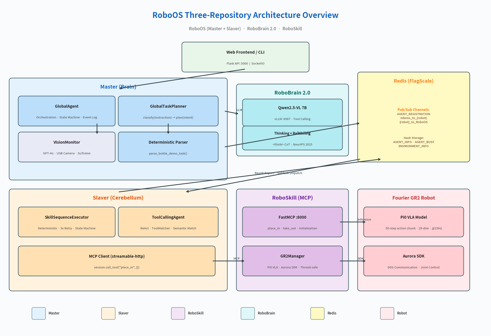
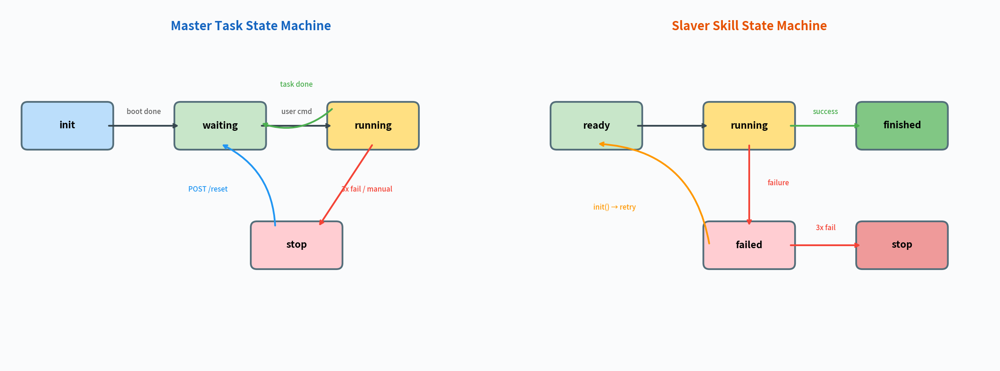
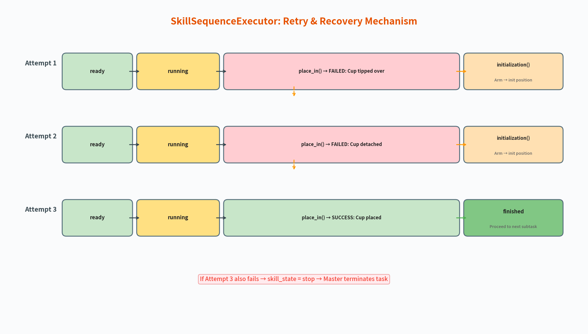
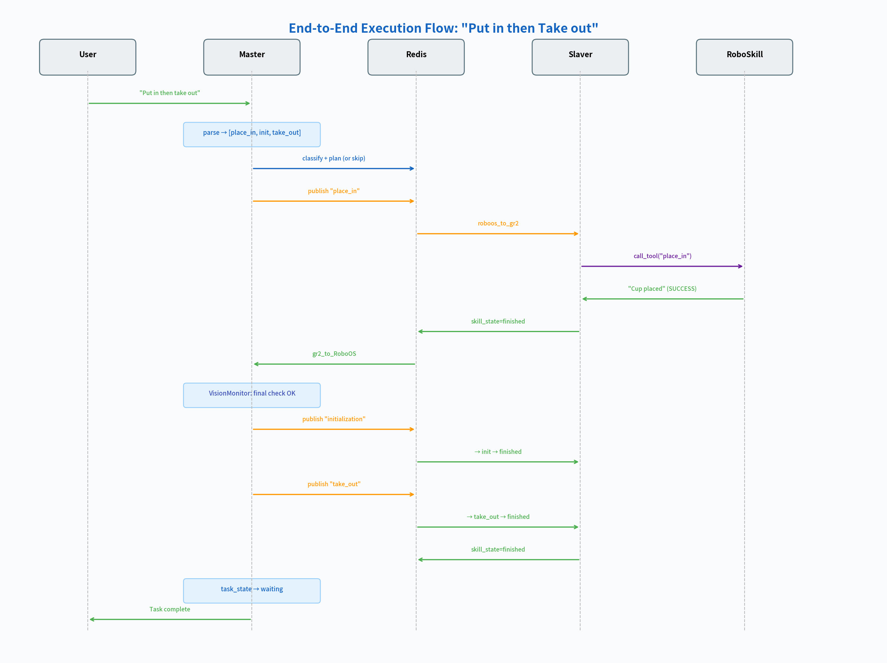

# RoboOS Embodied Intelligence System — Technical Report

## A Case Study of the "Bottle Grab" Demo

---

## 1. Introduction

### 1.1 Background

As Large Language Models (LLMs) converge with Embodied AI, robotic systems are evolving from hard-coded programs toward a new paradigm of natural language understanding, autonomous planning, and perceptual feedback. This project implements a **three-repository collaborative** robotic operating system, validated through a representative scenario: a Fourier GR2 dual-arm humanoid robot placing and retrieving a cup from a white paper box, demonstrating a complete closed-loop pipeline from natural language instruction to physical action execution.

### 1.2 System Positioning

| Repository | Role | Analogy |
|------------|------|---------|
| **RoboOS** | Robot Operating System (Master + Slaver) | OS Kernel + Device Driver |
| **RoboBrain 2.0** | Embodied Brain Model (Vision-Language-Reasoning) | CPU / AI Inference Engine |
| **RoboSkill** | Atomic Skill Library (MCP-Standardized) | System Calls / Driver Interface |

The three repositories are loosely coupled via **Redis Pub/Sub** (inter-process communication) and **MCP protocol** (skill invocation), supporting flexible combinations of multiple robots, scenarios, and models.

---

## 2. System Architecture

### 2.1 Three-Repository Architecture Overview



The system adopts a **hierarchical Master-Slaver architecture**:

- **Master (Brain)**: Receives natural language instructions, understands intent, plans subtask sequences, dispatches to Slaver for execution, and monitors via real-time visual feedback
- **Slaver (Cerebellum)**: Receives subtasks, maps them to atomic skill APIs, drives robot execution, manages skill state machine and failure retry
- **RoboSkill (Executor)**: MCP-standardized atomic skill server encapsulating hardware SDKs (Aurora SDK, Pi0 VLA model), providing a unified tool interface
- **RoboBrain 2.0 (AI Engine)**: Multi-modal large model based on Qwen2.5-VL, providing intent classification and task planning capabilities with Tool Calling and Chain-of-Thought reasoning
- **Redis / FlagScale Collaborator**: Distributed state management and message middleware handling agent registration, heartbeat, task dispatch, result reporting, and scene state synchronization

### 2.2 Communication Architecture

```
┌────────────┐    HTTP :5000     ┌────────────┐    Redis Pub/Sub    ┌────────────┐
│   Frontend  │ ───────────────→ │   Master    │ ←─────────────────→ │   Slaver   │
│  (Web/CLI)  │ ←─────────────── │  (agent.py) │                     │  (run.py)  │
└────────────┘    JSON Response  └─────┬───────┘                     └─────┬──────┘
                                       │ OpenAI API :4567                   │ MCP :8000
                                       ▼                                    ▼
                                ┌──────────────┐                    ┌──────────────┐
                                │ RoboBrain 2.0│                    │  RoboSkill   │
                                │ (vLLM Server)│                    │ (FastMCP)    │
                                └──────────────┘                    └──────────────┘
```

**Key Communication Protocols:**

| Channel | Protocol | Purpose |
|---------|----------|---------|
| Frontend ↔ Master | HTTP REST (Flask) | Task publishing, status queries, manual control |
| Master ↔ RoboBrain | OpenAI-compatible API | Intent classification, subtask planning |
| Master ↔ Slaver | Redis Pub/Sub (FlagScale) | Subtask dispatch, result reporting, state sync |
| Slaver ↔ RoboSkill | MCP streamable-http | Atomic skill invocation |
| RoboSkill ↔ Robot | Aurora SDK (DDS) / Pi0 | Joint control, VLA inference |
| Master → GPT-4o | OpenAI Vision API | Visual monitoring judgment |

---

## 3. Core Module Details

### 3.1 Master Module

The Master is the central orchestration hub, responsible for the complete pipeline from natural language to subtask sequences.

#### 3.1.1 Three-Layer Instruction Processing Pipeline

The Master employs a **determinism-first, LLM-fallback** three-layer strategy:

```
User Instruction (Natural Language)
    │
    ▼
Layer 1: Deterministic Regex Parsing (parse_bottle_demo_task)
    │   Match success → Generate skill sequence directly (<100ms, no LLM)
    │   Match failure ↓
    ▼
Layer 2: LLM Intent Classification (planner.classify)
    │   → PUT / TAKE / PUT_THEN_TAKE / TAKE_THEN_PUT / INVALID
    │   INVALID → Reject
    ▼
Layer 3: LLM Subtask Planning (planner.plan)
    │   → {reasoning_explanation, subtask_list}
    ▼
Subtask Sequence → _dispatch_subtasks_async()
```

**Design Rationale:** For the 4 known Bottle Demo commands, regex parsing is 100x faster than LLM, 100% deterministic, and incurs zero token cost. LLM serves as fallback only for unrecognized commands, preserving system extensibility.

#### 3.1.2 Two-Stage LLM Planner

GlobalTaskPlanner splits the traditional single LLM call into two stages:

| Stage | Input | Output | max_tokens | Purpose |
|-------|-------|--------|-----------|---------|
| classify | Raw user instruction | Intent label (1 word) | 64 | Fast classification, filter invalid instructions |
| plan | Intent + Scene + Robot capabilities | JSON subtask list | 1024 | Full planning |

**Advantages:** The classify stage is extremely lightweight, filtering INVALID instructions with minimal latency; the plan stage has full context for higher planning quality.

#### 3.1.3 GPT-4o Visual Monitoring (VisionMonitor)

The Master launches a VisionMonitor thread during each subtask execution, using a top-view USB camera + GPT-4o vision capability for active monitoring:

```
Subtask dispatched → Start monitor thread
                       │
                       ├── Every 3 seconds: capture frame → base64 → GPT-4o judgment
                       │   Returns: {"status": "executing|completed|failed",
                       │             "reason": "...", "confidence": 0.85}
                       │
                       ├── confidence ≥ 0.7 → Log event to execution log
                       │
Subtask ends → Stop monitor → Final-state confirmation (last frame GPT-4o review)
```

**Key Design Decisions:**
- **Supplements rather than replaces** Slaver's skill_state reporting — cross-verification from two information sources
- **Confidence threshold of 0.7** — low-confidence judgments do not trigger intervention, avoiding false positives
- Automatic graceful degradation on API call failure — does not block normal execution

#### 3.1.4 Task State Machine



The Master maintains global task state: `init → waiting → running → stop/waiting`

- **init**: System booting
- **waiting**: Awaiting user command (accepts new tasks)
- **running**: Task in progress (rejects new tasks)
- **stop**: Task terminated (requires `/reset` to recover)

All state transitions are recorded in the **execution event log**, queryable via the `/task_state` API in real time.

### 3.2 Slaver Module

The Slaver bridges the gap between Master and hardware, translating abstract subtasks into concrete MCP skill calls.

#### 3.2.1 Dual-Path Execution Engine

```python
async def _execute_task(self, task_data):
    task = task_data["task"]

    if is_bottle_demo_task(task):
        # Deterministic path: direct mapping to MCP skill
        executor = SkillSequenceExecutor(tool_executor=self.session.call_tool)
        result = await executor.execute(task)
    else:
        # LLM path: ReAct loop + semantic tool matching
        agent = ToolCallingAgent(tools=filtered_tools, ...)
        result = await agent.run(task)
```

| Path | Trigger Condition | Engine | LLM | Latency |
|------|------------------|--------|-----|---------|
| Deterministic | Subtask name ∈ {place_in, take_out, initialization} | SkillSequenceExecutor | None | ~0ms (excluding skill execution) |
| LLM-driven | All other tasks | ToolCallingAgent (ReAct) | Yes | ~5-10s |

#### 3.2.2 SkillSequenceExecutor State Machine & Retry



The SkillSequenceExecutor implements the complete skill state machine as specified in the requirements (S-2.1 through S-2.6):

```
ready → running → finished (success)
              ↘ failed → initialization() → ready (retry)
                                              ↘ stop (3 consecutive failures)
```

**Key Behaviors:**
1. After each failure, **`initialization()` must be called to return the arm to initial position** before retry
2. If `initialization()` itself fails, execution stops immediately (cannot safely retry)
3. After 3 consecutive failures → sends `skill_state="stop"` + `failure_info` to Master
4. Before termination, attempts `initialization()` to return to a safe position

**Success/Failure Detection:** Checks whether the MCP return string contains the `"FAILED"` keyword (consistent with RoboSkill's `skill_failure()` convention).

#### 3.2.3 ToolMatcher Semantic Tool Selection

For non-Bottle Demo tasks, the Slaver uses a three-tier semantic matching strategy to select the most relevant tools:

| Priority | Method | Model | Scenario |
|----------|--------|-------|----------|
| 1 | Sentence Transformer Embeddings | all-MiniLM-L6-v2 | GPU available / online |
| 2 | TF-IDF Vectorization | sklearn | No Transformer available |
| 3 | Keyword Matching | Rules | Minimal dependencies |

**Effect:** Filters the top-N most relevant tools from 100+ available (default 5), significantly reducing LLM context window usage and improving planning accuracy.

### 3.3 RoboSkill Module

RoboSkill is an **MCP-standardized atomic skill server** providing a unified skill interface for different robot platforms.

#### 3.3.1 MCP Protocol Integration

```python
from mcp.server.fastmcp import FastMCP

mcp = FastMCP(name="gr2_robot", stateless_http=True, host="0.0.0.0", port=8000)

@mcp.tool()
async def place_in() -> tuple[str, dict]:
    """Pick up the cup from the desk and place it into the white box."""
    ...
```

**Key Design Decisions:**
- `stateless_http=True`: Stateless HTTP transport, each request processed independently, supporting horizontal scaling
- Tool docstrings serve as LLM-readable API documentation, automatically exposed to Slaver's ToolCallingAgent
- Return format convention: `tuple[str, dict]`, failure strings contain the `"FAILED"` keyword

#### 3.3.2 Bottle Demo: Three Atomic Skills

| Skill | Control Method | Input | Output |
|-------|---------------|-------|--------|
| `place_in()` | Pi0 VLA Model | 3 cameras + robot state + text instruction | 50-step action chunk (29-dim @15Hz) |
| `take_out()` | Pi0 VLA Model | Same as above | Same as above |
| `initialization()` | Aurora SDK Direct Control | Current joint angles | Shortest-path trajectory |

#### 3.3.3 GR2Manager Hardware Abstraction

GR2Manager encapsulates the complete lifecycle of Aurora SDK connection management and Pi0 inference processes:

```
GR2Manager
├── connect()                       → Aurora SDK DDS connection
├── start_pi0_server(model_path)    → Launch inference server process
├── start_pi0_client(task)          → Launch action execution process
├── stop_pi0()                      → Terminate inference/execution processes
├── move_to_initial_position()      → Aurora SDK joint control
└── is_pi0_running()                → Check inference process status
```

**Thread Safety:** All methods are protected by `threading.Lock()`, ensuring concurrent MCP requests do not cause hardware state conflicts.

#### 3.3.4 Mock Testing & Fault Injection

`skill_mock.py` provides identical MCP interface signatures to the production version, with additional support for:

- **Simulated execution delays**: `MOCK_PLACE_IN_DURATION=5s` and other environment variables
- **State tracking**: `MockState` class maintains `connected` and `at_init_position` state
- **Precondition checking**: Same precondition logic as the production version
- **File-based failure injection**: Write to `/tmp/gr2_mock_fail.json` to trigger specified skill failures

```bash
# Trigger place_in failure
echo '{"place_in": "Cup tipped over"}' > /tmp/gr2_mock_fail.json
```

#### 3.3.5 Multi-Robot Support

The RoboSkill repository uses a `vendor/model/skill.py` directory structure, currently supporting:

| Robot | Type | Skills | Highlights |
|-------|------|--------|-----------|
| Fourier GR2 | Dual-arm Humanoid | 3 | Pi0 VLA + Aurora SDK |
| LeRobot SO101 | Single-arm Desktop | 13 | ACT Policy Network + Async Inference |
| Realman RMC-LA | Mobile Manipulator | 2 | GroundingDINO Detection + RealSense Depth |
| Demo Robot | Reference Implementation | 3 | Development Template |

### 3.4 RoboBrain 2.0

RoboBrain 2.0 is an **embodied intelligence brain model** developed by BAAI, providing visual understanding, language reasoning, and task planning capabilities for RoboOS.

#### 3.4.1 Model Architecture

```
Visual Input (Multi-image / Video)
    │
    ▼
Vision Encoder (Qwen2.5-VL)
    │
    ▼
MLP Projector → Unified Token Stream
    │
    ▼
LLM Decoder → Text Output / Tool Call / Coordinates / Trajectory
```

**Model Variants:**

| Variant | Parameters | Thinking Support | Recommended Use |
|---------|-----------|-----------------|-----------------|
| RoboBrain 2.0-3B | 3 Billion | No | Lightweight inference, edge deployment |
| RoboBrain 2.0-7B | 7 Billion | Yes | Balanced performance (used in this project) |
| RoboBrain 2.0-32B | 32 Billion | Yes | State-of-the-art performance |

#### 3.4.2 Thinking Mechanism

The 7B/32B models support Chain-of-Thought reasoning via `<think>` tags:

```xml
<think>
The user said "put in", which is a PUT-type instruction.
Need to call place_in() to put the cup into the box.
</think>
<answer>
{"intent": "PUT"}
</answer>
```

This mechanism was accepted at NeurIPS 2025 (Reason-RFT strategy).

#### 3.4.3 Tool Calling Integration

RoboBrain 2.0 implements **heuristic tool selection + semantic argument extraction**:

1. Parses tool definitions from RoboOS (compatible with both OpenAI and MCP formats)
2. Selects the most relevant tool via prompt text matching
3. Three-tier argument extraction: Semantic mapping → Description examples → Type inference
4. Returns OpenAI-compatible `tool_calls` format

#### 3.4.4 Deployment

```bash
# FastAPI + vLLM inference server
python inference.py --serve \
    --host 0.0.0.0 --port 4567 \
    --model-id /path/to/RoboBrain2.0-7B \
    --device-map auto \
    --enable-thinking
```

Exposes the `/v1/chat/completions` endpoint, fully compatible with the OpenAI API format. RoboOS connects via the standard openai Python SDK.

### 3.5 FlagScale Collaborator

FlagScale is a distributed agent collaboration framework developed by BAAI's Framework R&D team. RoboOS uses its `Collaborator` class as a Redis abstraction layer.

**Core Capabilities:**

| Function | Method | Redis Structure |
|----------|--------|----------------|
| Agent Registration | `register_agent(name, data)` | Hash: AGENT_INFO |
| Heartbeat Keepalive | `agent_heartbeat(name, ttl)` | Key with TTL |
| Task Dispatch | `send(channel, msg)` | Pub/Sub |
| Result Listening | `listen(channel, callback)` | Pub/Sub Subscribe |
| Busy/Free Management | `update_agent_busy(name, busy)` | Hash: AGENT_BUSY |
| Synchronous Wait | `wait_agents_free(names, timeout)` | Polling AGENT_BUSY |
| Scene State | `record_environment(name, json)` | Hash: ENVIRONMENT_INFO |

---

## 4. "Bottle Grab" Demo: End-to-End Flow

### 4.1 Scenario Definition

- **Objects**: 1 blue-patterned Luckin coffee cup, 1 fixed-position white paper box
- **Commands**: 4 basic command types + multi-step chain commands (challenge goal)
- **Robot**: Fourier GR2 dual-arm humanoid robot

### 4.2 Execution Flow



Using the command **"Put the cup into the box, then take it out"** as an example:

| Step | Component | Action | Latency |
|------|-----------|--------|---------|
| 1 | Frontend | `POST /publish_task {"task": "put in then take out"}` | — |
| 2 | Master | `parse_bottle_demo_task()` regex match → `[place_in, init, take_out]` | <1ms |
| 3 | Master | Create task_id, set `running` state, start async dispatch | <1ms |
| 4 | Master | Publish `place_in` to Slaver via Redis | <1ms |
| 5 | Master | Start VisionMonitor thread | <1ms |
| 6 | Slaver | `is_bottle_demo_task("place_in")` → SkillSequenceExecutor | <1ms |
| 7 | Slaver | `session.call_tool("place_in", {})` via MCP | — |
| 8 | RoboSkill | Launch Pi0 Server + Client, VLA inference execution | ~30-60s |
| 9 | RoboSkill | Return `("Cup placed successfully", {...})` | — |
| 10 | Slaver | No "FAILED" detected → `finished`, report result | <1ms |
| 11 | Master | VisionMonitor final-state confirmation: GPT-4o judges "completed" (95%) | ~3s |
| 12 | Master | Publish `initialization` → Slaver → arm returns to init position | ~3-5s |
| 13 | Master | Publish `take_out` → repeat steps 6-11 | ~30-60s |
| 14 | Master | All subtasks complete → `task_state = waiting` | <1ms |

### 4.3 Failure Handling Example

Suppose the cup tips over during `place_in` execution:

```
Attempt 1: place_in() → FAILED: Cup tipped over
           → initialization() → arm returns to initial position
Attempt 2: place_in() → FAILED: Cup detached from hand
           → initialization() → arm returns to initial position
Attempt 3: place_in() → FAILED: Execution timed out
           → skill_state = "stop"
           → initialization() (safe reset)
           → failure_info = {failed_skill: "place_in", attempts: 3, ...}
           → Master: task_state = "stop"
```

---

## 5. Technical Innovations

### 5.1 Determinism-First Hybrid Scheduling Architecture

Traditional robotic systems either rely entirely on rules (lacking flexibility) or entirely on LLMs (unreliable). This system introduces a **three-layer progressive** instruction processing approach:

```
Regex Matching (deterministic, 0ms) → LLM Classification (lightweight, ~1s) → LLM Planning (full, ~5s)
```

- Known commands take the fast path — 100% reliable
- Unknown commands take the LLM path — preserving extensibility
- Both paths produce a unified output format — downstream dispatch is agnostic to the source

### 5.2 GPT-4o Active Visual Monitoring

Unlike the traditional sequential "execute → judge → feedback" pattern, this system introduces **parallel visual monitoring** at the Master level:

- Execution and monitoring run **in parallel** — no additional serial latency
- GPT-4o multimodal capabilities understand complex scene semantics (not just pixel-level detection)
- Confidence mechanism prevents low-quality judgments from interfering with normal execution
- Final-state confirmation provides **cross-verification** for Slaver's reports

### 5.3 MCP-Standardized Skill Ecosystem

All robot skills are standardized through MCP (Model Context Protocol):

- **Unified Interface**: Any MCP client can invoke skills, no dependency on specific SDKs
- **Self-Describing**: Tool docstrings serve as LLM-readable API documentation
- **Stateless HTTP**: Supports horizontal scaling and load balancing
- **Multi-Robot Reuse**: The same Slaver can connect to different robots' MCP servers

### 5.4 RoboBrain 2.0 Embodied Reasoning

The embodied brain model based on Qwen2.5-VL offers unique advantages:

- **Multimodal Understanding**: Unified processing of images + video + text
- **Thinking Mechanism**: `<think>` tags enable explainable reasoning chains
- **Tool Calling**: Heuristic tool selection, adaptable to new tools without fine-tuning
- **Multi-Task Support**: 6 inference modes (general, pointing, affordance, trajectory, grounding, navigation)

### 5.5 FlagScale Distributed Collaboration

The Redis-based Collaborator framework enables:

- **Decentralized Registration**: Robots self-register, heartbeat keepalive, automatic expiration
- **Asynchronous Messaging**: Pub/Sub decouples Master and Slaver
- **Scene Sharing**: ENVIRONMENT_INFO enables multi-agent shared environmental awareness
- **Busy/Free Scheduling**: AGENT_BUSY + wait_agents_free implements synchronous waiting

### 5.6 Mock + Fault Injection Testing Framework

RoboSkill provides a complete offline testing framework:

- `skill_mock.py` has identical interface signatures to `skill.py`
- Simulated state tracking (connected, at_init_position)
- File-based failure injection — precisely control which skill fails and when
- Supports end-to-end RoboOS testing without connecting to real hardware

---

## 6. Architectural Characteristics

### 6.1 Loosely-Coupled Distributed Design

The three repositories communicate via standard protocols with no source-code dependencies:

| Interface | Protocol | Replacement Cost |
|-----------|----------|-----------------|
| Master ↔ Slaver | Redis Pub/Sub | Swap message middleware |
| Master ↔ RoboBrain | OpenAI API | Replace with any compatible API model |
| Slaver ↔ RoboSkill | MCP HTTP | Replace with any MCP server |

### 6.2 Dual-Path Fault Tolerance

The system implements fault tolerance at multiple levels:

```
Instruction Understanding: Regex → LLM (graceful degradation)
Tool Matching: Transformer → TF-IDF → Keywords (three-tier fallback)
Skill Execution: Success → Failure → Retry → Termination (state machine guarantee)
Visual Monitoring: GPT-4o → Degrade to Slaver-only reporting (API failure non-blocking)
```

### 6.3 Thread-Safe Concurrency

- Master: Flask main thread + async dispatch thread + VisionMonitor thread + Redis listener threads
- Slaver: asyncio event loop + heartbeat thread + Redis listener thread
- RoboSkill: GR2Manager with full-method locking, Pi0 processes with independent lifecycle management

### 6.4 Observability

A comprehensive execution event log system:

```json
{
    "task_state": "running",
    "events": [
        {"time": "14:30:01", "type": "task_start",     "message": "Received command: put in then take out"},
        {"time": "14:30:01", "type": "plan_done",       "message": "3 subtasks: place_in → init → take_out"},
        {"time": "14:30:02", "type": "dispatch",        "message": "Subtask 1/3: place_in → gr2"},
        {"time": "14:30:05", "type": "vision_check",    "message": "#1 executing (92%)"},
        {"time": "14:30:35", "type": "skill_done",      "message": "gr2: place_in → Cup placed"},
        {"time": "14:30:36", "type": "vision_final_ok", "message": "Final confirmation: place_in completed (95%)"},
        ...
    ]
}
```

### 6.5 Configuration-Driven

All component behaviors are adjustable via YAML configuration or environment variables:

- Master: `config.yaml` (model selection, visual monitoring, Redis connection)
- Slaver: `config.yaml` (robot type, tool matching parameters, retry count)
- RoboSkill: Environment variables (model paths, device IDs, inference parameters)

---

## 7. File Structure

### RoboOS

```
master/
├── run.py                     # Flask API server
├── config.yaml                # Master configuration
├── agents/
│   ├── agent.py               # GlobalAgent core orchestration
│   ├── planner.py             # Two-stage LLM Planner
│   ├── prompts.py             # CLASSIFY_PROMPT + PLANNING_PROMPT
│   └── vision_monitor.py      # GPT-4o visual monitoring
└── scene/
    └── profile.yaml           # Scene definition (desk, box)

slaver/
├── run.py                     # RobotManager + MCP client
├── config.yaml                # Slaver configuration
├── agents/
│   ├── slaver_agent.py        # ToolCallingAgent (ReAct)
│   ├── skill_executor.py      # SkillSequenceExecutor (deterministic)
│   └── models.py              # LLM interface (OpenAI/Azure)
└── tools/
    ├── tool_matcher.py        # Three-tier semantic tool matching
    └── memory.py              # SceneMemory + AgentMemory
```

### RoboSkill

```
fmc3-robotics/fourier/gr2/
├── skill.py                   # Production skill server (Pi0 + Aurora)
├── skill_mock.py              # Mock server (fault injection)
└── test_connection.py         # Connection testing tool
```

### RoboBrain 2.0

```
├── inference.py               # Inference engine + FastAPI server
├── startup.sh                 # Startup script
└── README.md                  # Documentation + benchmark results
```

---

## 8. Performance & Benchmarks

### 8.1 RoboBrain 2.0 Benchmarks

RoboBrain 2.0 achieves state-of-the-art results on 9 spatial understanding benchmarks and 3 temporal understanding benchmarks:

- Spatial: BLINK-Spatial, CV-Bench, EmbSpatial, RoboSpatial, RefSpatial, SAT, VSI-Bench, Where2Place, ShareRobot-Bench
- Temporal: Multi-Robot-Planning, Ego-Plan2, RoboBench-Planning
- Surpasses Gemini 2.5 Pro, o4-mini, Claude Sonnet 4, and other commercial models

### 8.2 System Latency Distribution

| Component | Latency | Notes |
|-----------|---------|-------|
| Regex instruction parsing | <1ms | Deterministic path |
| LLM classify | ~1-2s | 64 tokens |
| LLM plan | ~3-5s | 1024 tokens |
| Redis message passing | <1ms | Local Redis |
| MCP skill call overhead | ~50ms | HTTP round-trip |
| Pi0 VLA execution | 30-60s | Depends on action complexity |
| GPT-4o visual judgment | ~2-3s | Including network latency |
| Aurora SDK initialization | 3-5s | Joint motion time |

---

## 9. Conclusion & Future Work

This technical report uses the "Bottle Grab" Demo as an entry point to showcase the RoboOS + RoboBrain 2.0 + RoboSkill three-repository collaborative embodied intelligence system. The core contributions are:

1. **Three-Repository Decoupled Architecture**: OS, brain, and skills are independently developed and integrated via standard protocols
2. **Determinism-First Hybrid Scheduling**: Balancing reliability and flexibility
3. **Active Visual Monitoring**: GPT-4o parallel monitoring provides execution quality assurance
4. **MCP-Standardized Skill Ecosystem**: Reusable across multiple robots and scenarios
5. **Complete State Machine & Fault Tolerance**: 3x retry, automatic recovery, graceful termination

**Future Work:**
- Slaver-side CheckFinish/CheckFailed (real-time detection via head + wrist cameras)
- Pi0 model and Aurora SDK actual hardware integration and debugging
- Multi-robot collaborative tasks (parallel Slaver scheduling)
- Frontend UI for real-time task visualization
- Migration to additional scenarios (industrial inspection, logistics sorting, etc.)

---

*This report is based on RoboOS branch `stand-alone-fmc3-bottle-demo` and RoboSkill branch `fmc3-bottle-demo`.*
